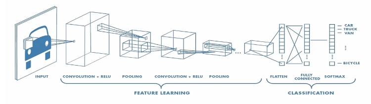

# Introduction

## Deep Learning

\begin{itemize}
\item Learns features automatically from raw data.
\item Inspired by the structure of the human brain.
\item Consists of:

\begin{itemize}
\item Input Layer – receives raw data
\item Hidden Layers – extract and transform features
\item Output Layer – makes the final prediction
\end{itemize}

\item Each "neuron" multiplies inputs with weights, applies an activation function, and passes to the next layer.
\end{itemize}

# CNN

## CNN (Convolutional Neural Network)

\begin{itemize}
\item A type of deep neural network specialized for image data.
\item Learns patterns like edges, textures, and shapes directly from images.
\item Typically consists of two main stages:
\begin{itemize}
\item \textbf{Feature Extraction:} Convolutional and pooling layers learn hierarchical image features.
\item \textbf{Classification:} Fully connected layers classify the extracted features into categories.
\end{itemize}
\end{itemize}

## CNN (Convolutional Neural Network)

\begin{itemize}
\item Key components:
\begin{itemize}
\item \textbf{Convolutional Layer} – extracts local features using filters and activation functions (e.g. ReLU)
\item \textbf{Pooling Layer} – reduces spatial dimensions and removes redundant information (optional but common)
\item \textbf{Fully Connected Layer} – performs the final classification using softmax activation
\end{itemize}
\end{itemize}


```{r,out.width="85%",echo=FALSE}

```

## Convolutional Layer

\begin{itemize}
\item Applies filters (kernels) to extract features from the input image.
\item The filter slides over the image (\textbf{stride}) — larger strides reduce output size and speed up computation.
\item To preserve image size and include edge features, \textbf{padding} (often zero-padding) is used.
\item As we stack more convolutional layers, feature maps become smaller and more abstract.
\end{itemize}


## Pooling Layer

\begin{itemize}
\item \textbf{Pooling layers} reduce the size of feature maps while preserving important information.
\item This helps lower computational cost and prevents overfitting.

\item Pooling also makes the model more robust to small translations in the image.
\item Common types of pooling include:
  \begin{itemize}
  \item Max Pooling: Selects the maximum value.
  \item Average Pooling: Computes the average.
  \end{itemize}
\end{itemize}

## Fully Connected Layer

\begin{itemize}
\item Also called a \textbf{Dense Layer}.
\item Every neuron is connected to all outputs from the previous layer.
\item Combines features to make the final decision, usually at the end of CNNs.
\item Flatten layer: Converts feature maps into a 1D vector for classification.
\item Dense layer: Each neuron processes all inputs and makes predictions.
\item Softmax activation: Outputs class probabilities.
\end{itemize}

# CNN Training with CIFAR-10 (Python)

## CIFAR-10 Dataset

\begin{itemize}
\item CIFAR-10 is a widely used benchmark dataset for image classification tasks.
\item It contains 60,000 color images,each of size 32 × 32 pixels and with 3 RGB channels.
\item The dataset is divided into:
\begin{itemize}
\item 50,000 training images
\item 10,000 test images
\end{itemize}
\item Images are labeled across 10 different categories: airplane, automobile, bird, cat, deer, dog, frog, horse, ship, truck
\end{itemize}

## Load Data and Define Model

```{python,eval=FALSE}
import tensorflow as tf
from tensorflow.keras.models import Sequential
from tensorflow.keras.layers import Conv2D, MaxPooling2D, Flatten, Dense
import numpy as np

(x_train, y_train), (x_test, y_test) = tf.keras.datasets.cifar10.load_data()
x_train, x_test = x_train / 255.0, x_test / 255.0


model = Sequential([
    Conv2D(32, (3,3), activation='relu', input_shape=(32,32,3)),
    MaxPooling2D((2,2)),
    Flatten(),
    Dense(64, activation='relu'),
    Dense(10, activation='softmax')
    # Conv2D → MaxPooling2D → Flatten → Dense → Output (Softmax)
])
```

## Compile, Train, Evaluate and Save

```{python,eval=FALSE}

model.compile(optimizer='adam', loss='sparse_categorical_crossentropy', 
metrics=['accuracy'])

model.fit(x_train, y_train, epochs=20, validation_data=(x_test, y_test))

test_loss, test_acc = model.evaluate(x_test, y_test)
print("Test accuracy:", test_acc)

model.save('cnn_model.h5')
```

# Connecting Python Model in R

## Load and Use CNN Model via reticulate

```{r,eval=FALSE}

library(reticulate)
keras <- import("tensorflow.keras")
np <- import("numpy")

cifar10_labels <- c("airplane", "automobile", "bird", "cat", "deer",
                    "dog", "frog", "horse", "ship", "truck")

model <- keras$models$load_model("cnn_model.h5")

predict_cnn <- function(input_array) {
  # reshape input: 1 sample of 32 x 32 RGB image
  input_array <- array_reshape(input_array, c(1, 32, 32, 3))
  
  preds <- model$predict(input_array)
  class_id <- np$argmax(preds)
  confidence <- round(np$max(preds) * 100, 2)
  list(class_id = class_id, confidence = confidence)}
```


## Shiny App

```{r,eval=FALSE}

library(shiny)
library(magick)

ui <- fluidPage(
  titlePanel("CNN 이미지 분류"),
  sidebarLayout(
    sidebarPanel(
      fileInput("image", "이미지 업로드(jpg/png)", 
                accept = c(".png", ".jpg", ".jpeg")),
      actionButton("predict", "예측 실행")
    ),
    mainPanel(
      h4("업로드된 이미지"),
      imageOutput("uploaded_img", height = "200px"),
      hr(),
      h4("예측 결과"),
      verbatimTextOutput("result")
    )))
```

## Shiny app – Image Upload and Prediction Trigger

```{r,eval=FALSE}

server <- function(input, output, session) {
  
  output$uploaded_img <- renderImage({
    req(input$image)
    list(
      src = input$image$datapath,
      contentType = input$image$type,
      width = 200
    )
  }, deleteFile = FALSE)
  
  observeEvent(input$predict, {
    if (is.null(input$image)) {
      output$result <- renderText({
        "이미지를 먼저 업로드해주세요."
      })
      return()}
```

## Shiny app - Image Preprocessing and Prediction Output
```{r,eval=FALSE}
    tryCatch({
      
      img <- image_read(input$image$datapath)
      img <- image_resize(img, "32x32")
      
      img_array <- as.integer(img[[1]])
      img_array <- img_array / 255
      dim(img_array) <- c(32, 32, 3)
      img_array <- array(img_array, dim = c(1, 32, 32, 3))
      
      pred <- predict_cnn(img_array)
      class_id <- pred$class_id
      confidence <- pred$confidence
      class_name <- cifar10_labels[class_id + 1]
```

## Shiny app - Image Preprocessing and Prediction Output
```{r,eval=FALSE}

      output$result <- renderText({
        paste0("예측된 클래스: ", class_id, " (", class_name, ")\n",
               "신뢰도: ", confidence, "%")
      })
      
    }, error = function(e) {
      output$result <- renderText({
        paste("오류 발생:", e$message)
      })
    })
  })
}

shinyApp(ui, server)
```

## Shiny App - Final Interface

\begin{center}
  \includegraphics[width=0.9\textwidth]{shinyapp.jpeg}
\end{center}
Users can upload an image, click the predict button, and receive classification results instantly.

##

\begin{center}
  {\bf {\Huge Q \& A}}
\end{center}


## 

\begin{center}
  {\bf {\Huge Thank You}}
\end{center}
